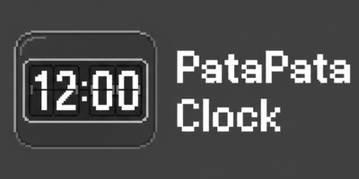

# PataPata clock
[](https://creativecommons.org/licenses/by-nc-nd/4.0/)   
[日本語版を見る](README_JP.md) | [English Version](README_EN.md)


パタパタ時計風のデジタルクロックに  
音楽プレイヤーを組み込んだ **Python アプリケーション**です。

このアプリケーションは **pygame** を使用しています。  
そのため、事前に pygame のインストールが必要です。

---

##  特徴

- フリップアニメーション付きデジタル時計
- ウィンドウリサイズ対応
- MP3 音楽再生機能  
  （再生 / 一時停止 / 次へ / 前へ）
- `music` フォルダに MP3 ファイルを入れるだけで  
  好きな音楽に変更可能

---

##  動作環境

- Python **3.9 以上**
- pygame **2.6 以上**

---

##  動作確認済み環境

- Raspberry Pi 5  
- mac mini（Apple Silicon / macOS Tahoe 26.1）

---

##  インストール

### Windows

1. [Python公式サイト](https://www.python.org/) から **Python 3** をインストール  
   ※ インストール時に  
   **「Add Python to PATH」** にチェックを入れてください.

2. コマンドプロンプトを起動し、以下のコマンドを実行
```bash
python -m pip install pygame
```
3. ファイルのあるフォルダへ移動して起動
（ダウンロードフォルダにある場合）
```bash
cd /d %USERPROFILE%\Downloads\PataPata_clock-main
python PataPata_clock.py
```

## mac
1. [Python公式サイト](https://www.python.org/) から **Python 3** をインストール  

2. ターミナルを起動し、以下のコマンドを実行（ファイルがダウンロードフォルダにある場合）
```bash
pip3 install pygame
cd ~/Downloads/PataPata_clock-main
python3 PataPata_clock.py
```

## Linux（raspberry pi）
1. [Python公式サイト](https://www.python.org/) から **Python 3** をインストール 

2. ターミナルで以下のコマンドを実行
```bash
sudo apt update
sudo apt upgrade
sudo apt install -y python3-pygame
```
3. ファイルのあるフォルダへ移動して起動（デスクトップにある場合）　　
```bash
cd ~/Desktop/PataPata_clock-main
python3 PataPata_clock.py
```

## 使い方
1. 以下コマンドでアプリを起動すると、ウィンドウが表示されます。
2. 画面下部の再生ボタンで音楽操作ができます。
3. 再生したい MP3 ファイルを以下のフォルダに入れてください。
＊ラズパイではwavの方が安定するのでそちらをご利用ください。

## バグ報告
基本的にバグについてはYoutube動画のコメント欄にてお願いします。

##  ライセンス

この作品は  
**Creative Commons Attribution-NonCommercial-NoDerivatives 4.0 International  
（CC BY-NC-ND 4.0）**  
のもとで公開されています。

© 2026 maronnulab

### 許可されていること
- YouTube などでの使用・紹介
- 個人利用
- 個人の範囲でのソースコードの変更

### 禁止されていること
- 商用利用・販売
- 改変しての公開
- 再配布（そのまま・改変後を問わず）
